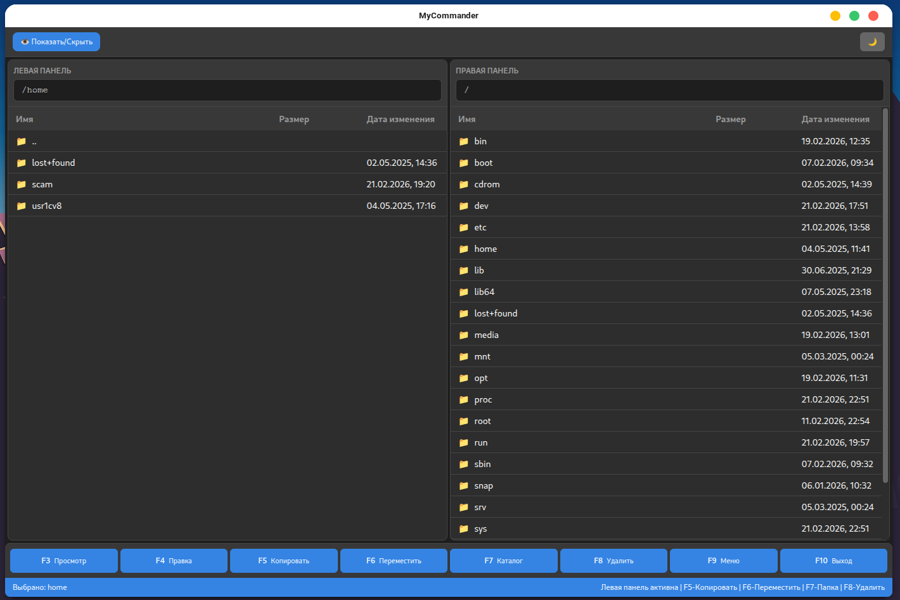
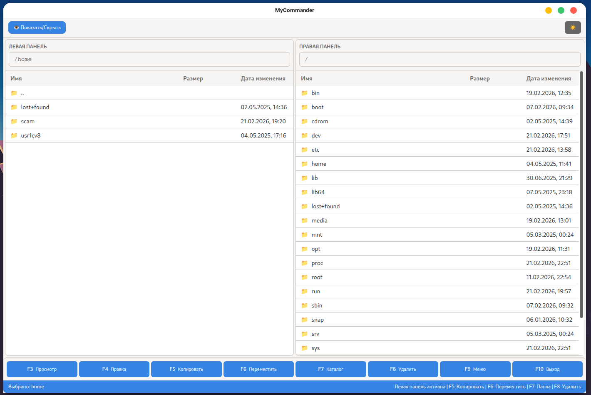

# MyCommander

Файловый менеджер в стиле TotalCommander на Electron с современным UI в теме GNOME Orchis.


## 🚀 Особенности

- **Две панели** для удобной работы с файлами
- **Тёмная/светлая тема** в стиле GNOME Orchis
- **Горячие клавиши** как в TotalCommander (F3-F10)
- **Копирование/Перемещение** с диалогом как в Midnight Commander
- **Скрытые файлы** - показ/скрытие (кнопка 👁)
- **Кроссплатформенность** - Windows и Linux

## 📦 Установка

### Windows

1. Скачайте `win-unpacked.zip` из [Releases](https://github.com/YOUR_USERNAME/mycommander/releases)
2. Распакуйте в любую папку
3. Запустите `MyCommander.exe`

### Linux

**AppImage (универсальный):**
```bash
chmod +x MyCommander-*.AppImage
./MyCommander-*.AppImage
```

**Debian/Ubuntu:**
```bash
sudo dpkg -i mycommander_*.deb
```

## 🔧 Сборка из исходников

### Требования

- Node.js 18+
- npm или yarn

### Установка зависимостей

```bash
npm install
```

### Запуск в режиме разработки

```bash
npm run dev
```

### Сборка дистрибутивов

**Linux:**
```bash
npm run dist:linux
```

**Windows (на Windows машине):**
```bash
npm run dist:win
```

**Все платформы:**
```bash
npm run dist:all
```

## ⌨️ Горячие клавиши

| Клавиша | Действие |
|---------|----------|
| `F3` | Просмотр |
| `F4` | Правка |
| `F5` | Копировать |
| `F6` | Переместить |
| `F7` | Новая папка |
| `F8` | Удалить |
| `F9` | Меню |
| `F10` | Выход |
| `Tab` | Переключение панелей |
| `Backspace` | Вверх по дереву |
| `Arrow Up/Down` | Навигация по файлам |

## 🛠️ Технологии

- [Electron](https://www.electronjs.org/) - кроссплатформенная основа
- [Tailwind CSS v4](https://tailwindcss.com/) - стилизация
- [Orchis Theme](https://github.com/vinceliuice/Orchis-theme) - дизайн

## 📸 Скриншоты

### Тёмная тема


### Светлая тема


## 📄 Лицензия

ISC

## 🤝 Вклад

1. Fork репозиторий
2. Создайте ветку (`git checkout -b feature/AmazingFeature`)
3. Commit изменений (`git commit -m 'Add some AmazingFeature'`)
4. Push в ветку (`git push origin feature/AmazingFeature`)
5. Откройте Pull Request
